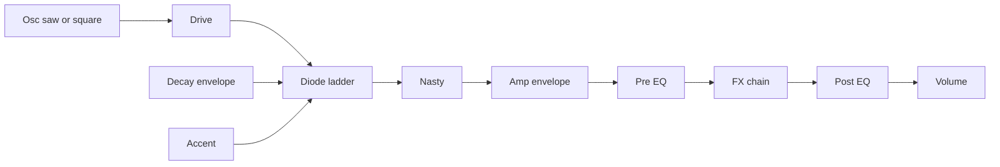

# TEW03 manual

A monophonic acid synth. Classic 303 squelch plus extra nastiness. The internal step sequencer is the main way you play it. Patterns drive the voice and also go out as MIDI so you can record them in a DAW or sequence something else.

This is the user book. Internals live in [Architecture](notes.html?doc=ARCHITECTURE.md) and [DSP notes](notes.html?doc=DSP_NOTES.md).

## How sound is made

One voice. One note at a time.

- **Oscillator** — saw or square (band-limited). Toggle **Waveform** on Main.
- **Drive** — gain into the diode-ladder filter. The ladder clips; this is the grit before cutoff, not a post-FX distortion.
- **Filter** — resonant low-pass. **Cutoff** and **Resonance** set the squelch. The same decay envelope that shapes the amp also opens the filter; **Env Mod** is how far.
- **Accent** — on accented steps (and MIDI notes that landed that way), extra level, cutoff, and resonance. MIDI out uses velocity 127 for accent, 100 otherwise.
- **Nasty** — after the filter. Mixes a saturated copy of the resonant peak back in. Zero is dry ladder output.
- **Amp envelope** — fast attack, **Decay** sets the fall. Then optional **Pre EQ**, the **FX chain**, optional **Post EQ**, then **Volume**.
- **Pitch bend** — ±2 semitones from MIDI.

**Slide vs Glide.** Per-step **S** ties into the next note and always ramps pitch. **Glide** also ramps when you play overlapping notes without slide. If Glide is at zero, a slide still gets a short default ramp (~50 ms) so the tie is audible.

## The three pages

The bar at the top left is the page switcher: **Main**, **Effects**, **EQ**. Click the name for a menu. Click the arrows (or the ends of the bar) to cycle.

**Volume** lives in the title strip on every page. Drag the fader. It can take an LFO like the Main knobs. A clip LED flashes when the output hits the limiter.

Click **TEW03** or the version number for About. **Check for update** looks at GitHub tags; if a newer build exists, **Open releases** opens the download page in your browser.

## Main — sequencer

Left column is transport and pattern. Centre is the piano roll.

### Play

Three modes:

- **Keyboard** — incoming MIDI notes play the voice. The sequencer can still run for MIDI out / playhead if **Run** is on, but you are playing from keys.
- **Pattern** — loops the selected bank/pattern while **Run** is on. In a DAW it follows host transport: Run on *and* the host playing. Standalone uses Run as the clock.
- **Key** — MIDI notes **C1–B3** (MIDI 24–59) map chromatically onto the 36 slots (3 banks × 12 patterns). Hold a key to play that slot. Note-off of the current key stops. Unmapped notes are ignored. Uses host BPM when the host provides it; does **not** require the host transport to be playing.

Factory default: Standalone opens in **Pattern** with **Run** off; in a DAW it opens in **Key** with **Run** on.

### Transport and slots

- **Run** — play / pause the sequencer.
- **Tempo** — 40–300 BPM. In a DAW the host BPM wins when the playhead reports one. Standalone (and hosts with no BPM) use this knob. LFOs and delay sync use the same tempo.
- **2x** — splits each step in half (16 sixteenths vs 32 thirty-seconds). Global for the live pattern length, not a per-step flag.
- **Bank** — pattern bank 1–3.
- **Pat** — pattern 1–12 in that bank. Click the number for a menu, arrows to step.
- **Key** / **Scale** — root (C–B) and Major / Minor. Used when **Lock** is on.
- **Lock** — snaps sequencer pitches to that key and scale. The piano-roll rows shrink to in-scale notes.
- **Clear** — empties the current pattern (notes, accent, slide).

Edits write into the live slot. Switching bank/pattern copies that slot into the live sequencer.

### Piano roll

Range is **C1–C4**. One octave of rows is visible; scroll for the rest.

- **Click** a cell to put that pitch on that step, or to clear it if it was already that pitch.
- **Drag** a note up/down to change pitch (snaps to scale when Lock is on).
- **Mouse wheel** on a note nudges pitch (scale steps when Lock is on).
- **Left gutter** — drag or wheel to scroll the view. Hold the top/bottom key overlays to keep scrolling.
- **A** under a column — accent that step.
- **S** under a column — slide / tie into the next step. A chevron and a line to the next note show the slide.
- **Playhead** — red column while the sequencer runs.
- **LFO overlay** — when an LFO is assigned to a knob, its shape is drawn across the bar (phase, not pitch).

## Main — knobs

Double-click a knob to reset it to the default.

- **Waveform** — off = saw, on = square.
- **Cutoff** — filter cutoff, 20–8000 Hz. Display is travel % plus Hz.
- **Resonance** — how hard the ladder peaks.
- **Env Mod** — how far the decay envelope opens cutoff.
- **Decay** — envelope fall, ~50 ms–2 s (shown as %).
- **Accent** — how much extra level / cutoff / resonance an accented step gets.
- **Drive** — osc gain into the ladder.
- **Glide** — portamento time (0–0.5 s, shown as %).
- **Nasty** — post-filter saturation mix.

**Volume** is the title-bar fader, not in this cluster.

## Main — LFOs

Two lanes at the bottom. **LFO 1** is green, **LFO 2** is orange. Each has a drawable breakpoint shape (up to 8 points).

### Shape

The name bar cycles presets: **Triangle**, **Sin**, **Saw Up**, **Saw Down**, **Square**. A hand-drawn shape shows **Custom**.

- Drag a point to move it. Endpoints stay at the left and right of the cycle.
- Double-click empty space to add a point.
- Right-click an interior point to delete it (need at least two points).
- A playhead line moves when the LFO is running.

### Timing

- **Mode — Free** — runs continuously.
- **Mode — Trigger** — resets to the start of the shape on each note-on (keyboard or sequencer).
- **Sync** off — **Rate** is 0.05–30 Hz.
- **Sync** on — **Div** sets cycle length: 1/16, 1/8, 1/4, 1/2, 1 bar, 2 bars (at the current tempo). **LFO 1** Sync is on by default (1/4); **LFO 2** Sync is off.
- **Smooth** — lags the shape. 0 is raw breakpoints; 100% is a ~250 ms lag.

### Assigning

Drag the **LFO 1** / **LFO 2** handle onto a knob (or the volume fader). Right-click a knob and pick LFO 1, LFO 2, or None.

A numbered badge appears on the control. Drag that badge vertically for **amount** (−100% to +100%). The LFO is bipolar around the knob’s current value.

Destinations: cutoff, resonance, env mod, decay, accent, drive, glide, volume, nasty. **Tempo** cannot take an LFO.

Each destination takes **one** LFO.

## Patches and banks

Two libraries. Loading one does not overwrite the other.

- **Patch** (`.tew3p`) — sound knobs, play settings, LFO shapes, FX parameters and order. Never includes the 36 patterns or the current bank/pattern index.
- **Bank** (`.tew3b`) — all 36 patterns. Never includes patch knobs.

Files live in `%APPDATA%/Stupid Systems LLC/TEW03/Patches` and `.../Banks`. The title bars show the current names. The DAW session stores those names for recall.

Click a bar for the menu: **Init Patch** / **Init Bank**, the saved list, then **Save**, **Save As…**, **Export…**, **Import…**. Arrows on the bar step through saved files. Init restores defaults / factory fills.

## Effects

Click the page bar to **Effects**. Everything is **off** until you enable it.

Left rail: click a name to add that effect (turns it on and shows its row). Click again to bypass. Drag rows to reorder the chain. Order is stored with the patch.

The insert **Equalizer** is the same five-band parametric as Pre/Post, but it sits *in* the chain and moves with the other rows. Pre/Post sit around the whole chain and are edited on the EQ page.

### Chorus

Rate, Depth, Fb (feedback), Mix.

### Compressor

Thresh (−40 to 0 dB), Ratio (1–20), Atk (0.1–100 ms), Rel (10–500 ms), Mix (100% = fully compressed).

### Delay

**Sync** on: **Div** is 1/16, 1/8, 1/4, or 1/2 at tempo. **Sync** off: **Time** is free. Then Fb, Cut (damping in the feedback), Mix.

### Distortion

Drive, Mix. Separate from the synth **Drive** knob; this is after the voice (position in the chain is yours).

### Equalizer

Five bands. Click a band on the mini plot, then set Type, Freq, Gain, Q. Types match the EQ page: Off, Peak, Low S, High S, HP, LP.

### Filter

Type Low / Band / High, Cutoff (20–12000 Hz), Res, Mix. Extra filter in the FX chain, not the 303 ladder.

### Flanger

Rate, Depth, Fb, Mix.

### Phaser

Rate, Depth, Fb, Centre (200–4000 Hz), Mix.

### Reverb

Size, Damp, Width, Mix.

## EQ

Click the page bar to **EQ**. This is Pre-FX and Post-FX, five bands each, both **off** until you enable them.

- **Pre** LED — EQ before the FX chain.
- **Post** LED — EQ after the FX chain.
- **Edit Pre** / **Edit Post** — which set of five bands you are looking at.

The graph is the response of the set you are editing. The spectrum behind it is a post-FX FFT (what leaves the chain), not a live input analyser.

### Bands

Each band: **Off**, **Peak**, **Low S** (low shelf), **High S** (high shelf), **HP**, **LP**. Defaults start around 80 / 250 / 1k / 4k / 10k Hz, 0 dB, Q 0.7. Gain is ±12 dB. Q is 0.1–10. Freq is 20 Hz–20 kHz.

### Inspector

- **On** — Peak if it was Off, Off if it was any other type.
- **&lt;** / **&gt;** — previous / next band.
- Type combo, **FREQ**, **GAIN**, **Q**.

### Graph

- Drag a handle — frequency (X) and gain (Y).
- Mouse wheel — Q.
- Double-click a handle — reset that band.

## MIDI

- **In (Keyboard mode)** — note on/off and pitch bend (±2 semitones).
- **Out** — the sequencer (and/or what the voice is playing) as MIDI notes, so you can record the pattern in the DAW. Accent = velocity 127, otherwise 100.

VST3 and standalone.

## More notes

- [Brief](notes.html?doc=PRD.md)
- [Architecture](notes.html?doc=ARCHITECTURE.md)
- [DSP notes](notes.html?doc=DSP_NOTES.md)
